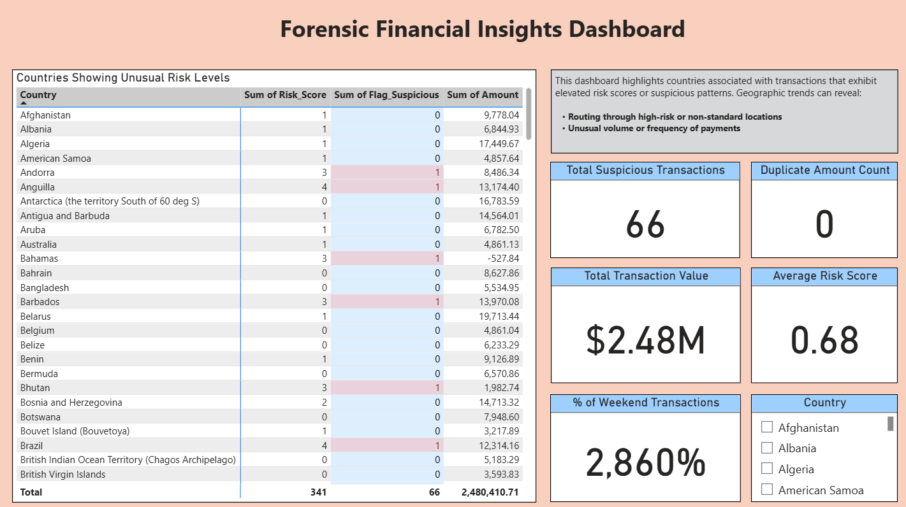

# 💼 Forensic Financial Insights Dashboard

A Power BI dashboard designed to uncover suspicious financial activity through key risk metrics, anomaly detection, and transaction analysis — empowering investigators and analysts with actionable insights.

## 🚀 Project Overview

The **Forensic Financial Insights Dashboard** helps identify high-risk countries and potential fraudulent financial behavior by analyzing transaction patterns, duplication, and timing anomalies.

This dashboard supports forensic accountants, compliance teams, and financial investigators in monitoring, auditing, and investigating large volumes of financial data.

## 📂 Data Overview

This project uses a fictional or anonymized dataset of global financial transactions, with fields including:
- Country of origin Risk Levels
- Transaction amount
- Average Risk score
- Percentage of Weekend Transactions
- Total Amount of Suspicious Transactions
- Duplicate flag

Data was preprocessed in Power Query and modeled using DAX to enable advanced insights and interactive filtering.

## 📌 Key Features

- 🌍 **Country Risk Table**  
  A sortable table highlighting countries with unusual or elevated risk levels based on transaction scoring logic.

- 🧾 **Key Metrics Scorecards**
  - **🔍 Total Suspicious Transactions**  
    Count of transactions flagged with high-risk scores.
  - **🔁 Duplicate Amount Count**  
    Number of transactions with duplicate monetary values, indicating possible laundering or system errors.
  - **💰 Total Transaction Value**  
    Sum of all transaction amounts, helping to quantify risk exposure.
  - **⚠️ Average Risk Score**  
    Mean of all assigned risk scores, providing a health check of the data.
  - **📆 % of Weekend Transactions**  
    Percentage of transactions occurring on weekends — an anomaly indicator in many business contexts.

## 🧠 Tools & Skills Used

- Power BI (Data modeling, DAX, Visual Design)
- Power Query (ETL transformations)
- Excel (Data preparation and validation)
- GitHub (Documentation & versioning)

## 🎯 Purpose

To surface hidden patterns in transactional data for early detection of financial fraud, money laundering, and compliance violations.

## 📁 Files Included
- `Forensic-Financial-Insights_Dashboard.pbix`: Main Power BI project file
- `Forensic_Transaction_Data.csv`: Sample dataset
- `forensic-financial.png`: Visual preview of the report

- ## 🖼 Sample Screenshot

## 🗂️ Project Status

✅ Complete – Ready for demonstration and portfolio inclusion  

## 📫 Contact
Catherine McKillips

[LinkedIn](https://www.linkedin.com/in/catherine-mckillips-data-analytics)  

## 📧 Email
cathymckillips@gmail.com

